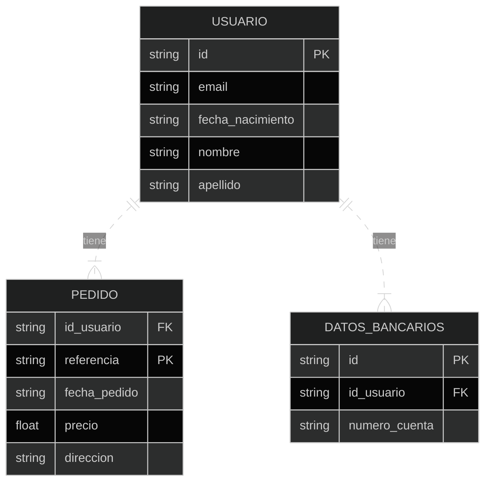

**Modelo relacional**
{: .main-title }

Es el modelo de datos más utilizado en la actualidad.

Los datos se organizan en tablas relacionadas entre sí mediante claves primarias y claves externas. Las relaciones entre las tablas se establecen a través de las claves externas, lo que permite realizar consultas complejas utilizando el lenguaje **SQL (Structured Query Language)**.

### Tabla de contenido
{: .no_toc .text-delta }

1. TOC
{:toc}

## **¿Cómo crear un modelo relacional?**

Estos son los pasos básicos para crear un modelo relacional.

1. ### **Identificar las Entidades** 
Identificar las entidades principales de los sistemas que se desean modelar, estas son las cosas o conceptos sobre los cuales se desean almacenar información. 

**Ejemplo**, en sistemas de gestión de bibliotecas, las entidades podrían ser libros, autores, usuarios, préstamos, etc.

2. ### **Identificar los Atributos** 
Para cada entidad identificada, determinar qué información se necesita almacenar, estos son los atributos de las entidades. 
**Ejemplo**, para la entidad "libros", los atributos podrían ser ISBN, título, autor, año de publicación, etc.

3. ### **Identificar las Relaciones** 
Una relación describe cómo están conectadas dos entidades entre sí. 
**Ejemplo**, en sistemas de gestión de bibliotecas, hay relaciones entre "libros" y "autores" (un libro puede tener uno o más autores), y entre "préstamos" y "usuarios" (un usuario puede realizar uno o más préstamos).

4. ### **Refinar las Relaciones** 
Especificar la cardinalidad y la naturaleza de las relaciones entre las entidades. La cardinalidad indica cuántos registros de una entidad pueden estar relacionados con cuántos registros de la otra entidad. **Ejemplo**, la relación entre "libros" y "autores" puede ser de uno a muchos (un libro tiene un autor, pero un autor puede escribir varios libros), además, determinar si la relación es obligatoria u opcional.

5. ### **Diseñar el Esquema Relacional** 
Una vez que se hayan identificado las entidades, atributos y relaciones, se puede diseñar el esquema relacional. 

    1. Cada entidad se convierte en una tabla.
    2. Cada atributo en una columna.
    3. Cada relación en una clave foránea que conecta las tablas. 

    Se deben definir claves primarias para identificar de forma única cada registro en una tabla.

6. ### **Normalización** 
Aplicar reglas de normalización para eliminar redundancias y anomalías en el diseño de las bases de datos. 
    
    - La normalización asegura que las bases de datos estén bien estructuradas y sean eficientes.     

    Las formas normales más comunes son la primera forma normal (1NF), la segunda forma normal (2NF) y la tercera forma normal (3NF).

## **Ejemplo de un diagrama de modelo relacional**

