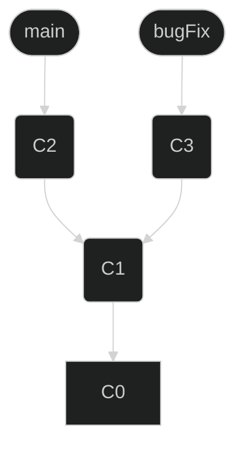

# Merge

<div class="code-example" markdown="1" style="padding-top: 1em; gap: 1em; display: flex; justify-content: center; align-items: center; flex-direction: column;">

### **El comando "git merge" se utiliza para combinar cambios de una rama en otra.** 
Inicialmente tendremos un repositorio con dos ramas, `main` y `bugFix`. `main` es la rama principal y `bugFix` es una rama que se creó para corregir un error.



```markdown
Git merge bugFix
```
</div>


Para actualizar la posición de `bugFix` a `main` se debe usar:

```dart
Git checkout bugFix

Git merge main
```


Como `bugFix` ya era un ancestro de `main`, git no tuvo que hacer ningún trabajo, solamente se movió `bugFix` al mismo commit en el que estaba posicionado main.

Ahora todas las ramas contienen el trabajo que hay en el repositorio.