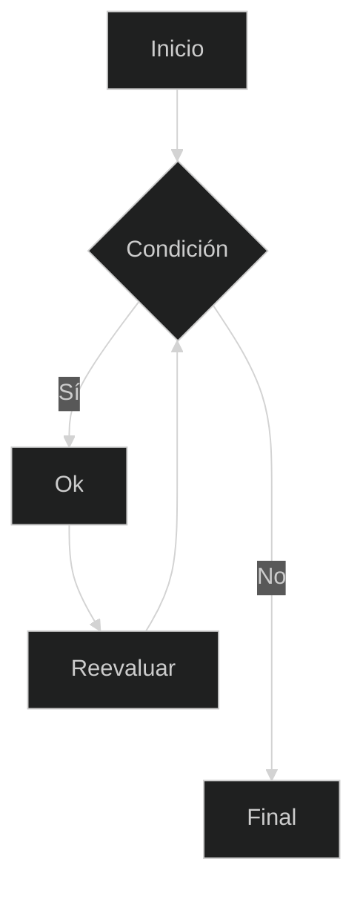
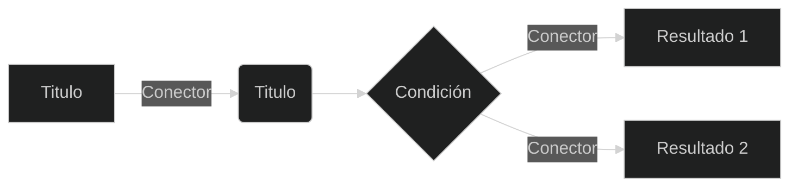
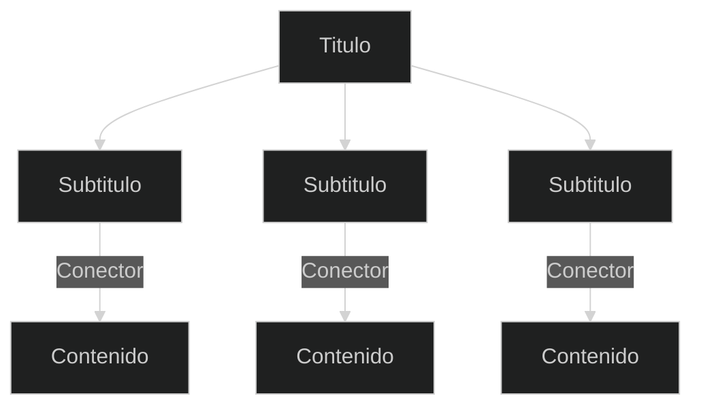

{: .no_toc }

## Tabla de contenidos
{: .no_toc .text-delta }

1. TOC
{:toc}

Esta página es una ayuda personal para recordar los comandos y codigos de estilos que se pueden utilizar para las demás páginas de notas en este sitio.
{: .fs-5 .fw-200 }

---

## Botones

<div class="code-example" markdown="1">

[Botón azul](#){: .btn .btn-blue }
[Botón rosado](#){: .btn .btn-pink }
[Botón morado](#){: .btn .btn-purple }
[Botón amarillo](#){: .btn .btn-yellow }
[Botón verde](#){: .btn .btn-green }
[Botón rojo](#){: .btn .btn-red }

[Botón con borde](#){: .btn .btn-outline }

```markdown
[Azul](#){: .btn .btn-blue }
[Rosado](#){: .btn .btn-pink }
[Morado](#){: .btn .btn-purple }
[Amarillo](#){: .btn .btn-yellow }
[Verde](#){: .btn .btn-green }
[Rojo](#){: .btn .btn-red }

[Outline](#){: .btn .btn-outline }
```

</div>

---

## Etiquetas

<div class="code-example" markdown="1">

Etiqueta azul
{: .label .label-blue }

Etiqueta rosada
{: .label .label-pink }

Etiqueta verde
{: .label .label-green }

Etiqueta morada
{: .label .label-purple }

Etiqueta amarilla
{: .label .label-yellow }

Etiqueta roja
{: .label .label-red }

</div>

```markdown
Etiqueta azul
{: .label .label-blue }

Etiqueta rosada
{: .label .label-pink }

Etiqueta verde
{: .label .label-green }

Etiqueta morada
{: .label .label-purple }

Etiqueta amarilla
{: .label .label-yellow }

Etiqueta roja
{: .label .label-red }
```

---

## Tablas

<div class="code-example" markdown="1">

| Titulo 1 | Titulo 2 | Titulo 3 |
| :------- | :------- | :------- |
| celda 1  | celda 2  | celda 3  |
| celda 4  | celda 5  | celda 6  |

</div>

```markdown
| Titulo 1 | Titulo 2 | Titulo 3 |
| :------- | :------- | :------- |
| celda 1  | celda 2  | celda 3  |
| celda 4  | celda 5  | celda 6  |
```

---

## Campo para escribir código

<div class="code-example" markdown="1">

```java

    class test {
        public static void main(String[] args) {
            System.out.println("Hello, World!");
        }
    }

```

</div>

````markdown
    ```java

        class test {
            public static void main(String[] args) {
                System.out.println("Hello, World!");
            }
        }

    ```
````

---

## Citas

<div class="code-example" markdown="1">

{: .amarillo }
Amarillo

{: .rosado }
Rosado

{: .morado }
A paragraph

{: .azul }
Azul

{: .verde }
Verde

{: .rojo }
Rojo

---

{: .rojo }
> {: .azul }
> Citas anidadas.


</div>

```markdown
{: .amarillo }
Amarillo

{: .rosado }
Rosado

{: .morado }
A paragraph

{: .azul }
Azul

{: .verde }
Verde

{: .rojo }
Rojo

---

{: .rojo }
> {: .azul }
> Citas anidadas.
```

---

## Listas

### Lista numerada
<div class="code-example" markdown="1">
1. Item 1
1. Item 2
1. Item 3
</div>
```markdown
1. Item 1
1. Item 2
1. Item 3
```

### Lista desordenada
<div class="code-example" markdown="1">
- Item 1
- Item 2
- Item 3
</div>
```markdown
- Item 1
- Item 2
- Item 3
```

---

## Mapas con mermaid

### Mapa de flujo

<div class="code-example" markdown="1">


</div>
```markdown

    ```mermacid
    
    %%{init: { 'theme':'dark' } }%%

    flowchart TD
        A[Inicio] --> B{Condición}
        B -- Sí --> C[Ok]
        C --> D[Reevaluar]
        D --> B
        B -- No ----> E[Final]

    ```
```

---

### Mapa de decisiones
<div class="code-example" markdown="1">

</div>
```markdown

    ```mermaid
    
    %%{init: { 'theme':'dark' } }%%
    flowchart LR
    
        A[Titulo] -->|Conector| B(Titulo)
        B --> C{Condición}
        C -->|Conector| D[Resultado 1]
        C -->|Conector| E[Resultado 2]
    
    ```

```

---

### Mapa conceptual
<div class="code-example" markdown="1">

</div>
```markdown
   ```mermaid

    %%{init: { 'theme':'dark' } }%%
    
    flowchart TD
        A[Titulo] --> B[Subtitulo] -->|Conector| D[Contenido]
        A[Titulo] --> C[Subtitulo] -->|Conector| E[Contenido]
        A[Titulo] --> G[Subtitulo] -->|Conector| H[Contenido]
    
    
    ```
```