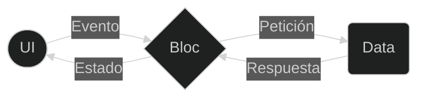

**Business Logic Components - BLOC**
{: .main-title}

{: .label .label-green style="margin-top: 1.2em"}
Flutter / dart

El patrón BLoC (Business Logic Component) es una arquitectura de software que se utiliza para separar la lógica de negocio de la interfaz de usuario (UI) y la capa de datos, esta separación de responsabilidades hace que el código sea más fácil de mantener, probar y reutilizar.

### Tabla de contenido
{: .no_toc .text-delta }

1. TOC
{:toc}

<div class="code-example" markdown="1">

## **Estructura de proyectos**

- Es una buena práctica organizar el código en una estructura de carpetas que refleje las características de la aplicación cuando se usa el patrón BLoC (Business Logic Component) en Flutter.

```markdown
    lib/
      features/
        feature1/
          bloc/
            feature1_bloc.dart
            feature1_event.dart
            feature1_state.dart
          ui/
            feature1_screen.dart
        feature2/
          bloc/
            feature2_bloc.dart
            feature2_event.dart
            feature2_state.dart
          ui/
            feature2_screen.dart
      ...
```

</div>

**Las tres capas principales en una arquitectura BLoC son:**
1. Presentación
2. Lógica de negocio
3. Datos

<div class="code-example" markdown="1">

## **Presentación**
    
- Esta es la capa de la interfaz de usuario, aquí es donde se manejan las interacciones del usuario y se muestran los datos, estos serían los widgets. 

- Esta capa no debería contener ninguna lógica de negocio. En lugar de eso, debería delegar esa responsabilidad a la capa de lógica de negocio.
    
</div>

<div class="code-example" markdown="1">

## **Business Logic (DOMINIO)** 
    
- Esta es la capa donde se maneja toda la lógica de negocio. En BLoC, esto se hace a través de los BLoCs. Los BLoCs toman eventos de la capa de presentación y emiten estados. Los BLoCs no deberían saber nada sobre la capa de presentación o la capa de datos.
    
</div>

<div class="code-example" markdown="1">

## **Data**

Esta capa se encarga de obtener y almacenar datos, puede estar dividida en dos partes:

---

### **Repository**
- Esta es la interfaz entre la capa de lógica de negocio y la capa de datos. Los BLoCs interactúan con los datos a través del repositorio. El repositorio puede obtener datos de diferentes fuentes y combinarlos de la manera que necesite la lógica de negocio.

---

### **Data Provider**
- Esta es la parte de la capa de datos que interactúa directamente con la fuente de datos. Puede ser una base de datos local, una API, etc. El proveedor de datos no sabe nada sobre la lógica de negocio y simplemente proporciona los datos que se le piden.

</div>

<div class="code-example" markdown="1">

## **Explicación detallada del funcionamiento de Bloc**

<div class="code-example" markdown="1" style="padding-top: 1em; display: flex; justify-content: center; align-items: center; flex-direction: column;">


</div>

Como vemos en la zona izquierda de la imagen, la capa de presentación (interfaz) le envía eventos al bloc y este le responde con un nuevo estado. Si miramos la parte derecha veremos el esquema común de cliente-servidor, en el cual el bloc le hace una petición al servidor(backend) y este le responde, todo esto de manera asíncrona.

Dicho esto, el flujo de nuestra aplicación sería:

- La interfaz envía un evento al bloc, este recibe el evento y manda una petición al servidor, el servidor le responde al bloc y el bloc crea un nuevo estado con la respuesta y se la envía a la interfaz.

---

### **Una aplicación se puede componer de múltiples BLoC**

- Tal como sería una mala idea dejar todo la lógica de la aplicación en el mismo lugar que el código de la interfaz de usuario, también es una mala idea tener un solo bloc que contenga el estado global de toda la aplicación.

Se debería tener un bloc por cada funcionalidad o propósito que tenga nuestra aplicación:

{: .label .label-pink}
Ejemplo

Si tuviéramos que desarrollar el login de una aplicación normal deberíamos tener dos bloc. 

1. Uno que sea capaz de verificar el estado si un usuario esta autenticado o no (verificando si existe algún token en el dispositivo) 

1. y otro que sea capaz de manejar el estado del formulario y enviando los datos al backend y verificar si las credenciales son correctas o no para luego notificar el bloc de autenticación.

</div>